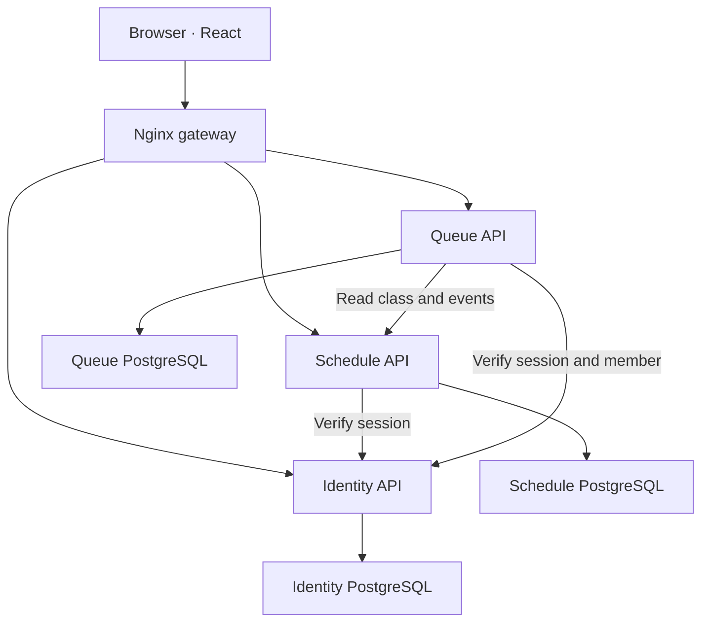

# Architecture

Version 1.0.0 targets one academic group with two subgroups. Roles and registration belong to that installation. Multi-university tenancy and arbitrary numbers of subgroups are not implemented.

## Services and ownership

| Service | Data it owns | Responsibilities |
| --- | --- | --- |
| auth | users, sessions, invitations, reset codes, audit, rate gates | Argon2 passwords; opaque cookie sessions; approval; roles; CSRF; invite/reset consumption |
| schedule | settings, rules, occurrences, audit, events | Academic parity; recurring lessons; stable occurrence IDs; exceptions; conflict validation; ICS |
| queue | queues, entries, command keys, audit, event cursor | Order and capacity; one active entry per student/queue; one called entry per queue and per student; expiry and reconciliation |
| web | compiled frontend assets | Same-origin API routing, request size limit, browser response headers |

The services never connect to another service's database. Each database is placed on a separate internal Docker network, accessible only by its owning API. Only the web gateway port is published. The APIs share a private service network and an internal authentication token; the gateway strips client-supplied internal tokens and denies `/internal/` routes.

The three PostgreSQL containers can be consolidated into a managed PostgreSQL deployment with separate databases and roles later. Their logical ownership must remain separate.

## Time and schedule

Dates are represented as ISO calendar dates in the configured semester timezone. Start/end instants include a timezone offset. Week parity uses a reference Monday and reference parity, independent of ISO week numbering. PostgreSQL audit timestamps are stored as naive UTC and serialized with a `Z` suffix.

Rule edits generate the semester's occurrences. Each occurrence ID is a deterministic UUID of the rule ID and original date. Moving an occurrence updates its displayed date while retaining its ID and original date. Individual overrides are preserved during later rule changes. Normal past occurrences are not rewritten by template changes.

Schedule mutations lock the settings singleton to serialize conflict checks and generation. Optimistic revision fields reject stale editors. Cancelled occurrences do not participate in conflict checks. Different subgroups may overlap; whole-group classes cannot overlap either subgroup.

## Queue consistency

Queue writes lock the queue row with `SELECT ... FOR UPDATE`. Partial unique indexes independently enforce active-entry/called-entry invariants. Last-place races are resolved under the same lock that counts active entries and assigns the next ticket.

Commands require an `Idempotency-Key`, scoped to user, queue and request key. A fingerprint prevents reuse with different arguments. A successfully replayed command returns current queue state. It does not recreate an entry after a subsequent leave. Manager mutations also require the current queue revision; repeated completed commands are recognized before revision validation.

Schedule events are written in the same transaction as a schedule change. The queue worker reads them with a persistent sequence cursor, polls every three seconds after each processing cycle and also checks non-closed queues for expiry. It tolerates retries. Queue details reconcile state synchronously; critical commands fetch the current lesson and fail when the upstream service is unavailable. There is no Kafka/RabbitMQ broker and no distributed transaction. A concurrent lesson edit may race an already-running queue command; reconciliation resolves that window. Three seconds is a normal polling interval, not a guaranteed end-to-end SLA during outages or backlogs.

## Authentication

Session cookies are HttpOnly and SameSite=Lax; production HTTPS deployments enable Secure through `COOKIE_SECURE=true`. API mutations verify a per-session CSRF token, and the middleware validates supplied Origin / Sec-Fetch-Site headers. Passwords use Argon2. Setup, login, registration and reset requests are rate-limited using persistent database counters.

Active status and role are checked through the identity service, without long-lived role-bearing JWTs. Blocking an account and resetting/changing its password revoke existing sessions. Invite/reset tokens are hashed in storage; raw codes are returned only at creation. Email sending, SSO, MFA and an automated verification of university membership are not connected. Managers verify applicants manually.

## Deployment and schema evolution

Compose waits for database and API healthchecks. Readiness checks issue a database query. API images run as an unprivileged user with a read-only root filesystem; databases persist in named volumes. Nginx supplies the only public listener. Internet-facing deployment requires a TLS proxy and an exact configured origin.

Schema version 1 is created on first launch under a PostgreSQL advisory lock. The app refuses databases with a schema version above 1. This is an initial migration, not a general-purpose migration framework. Future schema changes need explicit versioned migrations and a tested backup/restore procedure; modifying SQLAlchemy models alone is insufficient.

SQLite is available only for local development and smoke tests. It serializes transactions using `BEGIN IMMEDIATE` and is not a substitute for the PostgreSQL concurrency gate in CI.

## Extension points

- REST/OpenAPI per service.
- Cursor-based schedule events for an external bot or sync worker.
- Authenticated iCalendar snapshot export.
- Future notifications should use a dedicated service and delivery queue, storing delivery retries separately from lab queue transactions.
- Multi-group support would require group membership and access scoping in every service; it is not just a new frontend filter.
